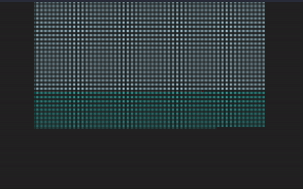

# Lifetime

Experiments with how to create a performant ReactJS component that renders thousands of "units" over time, but within very small time intervals (1-5 milliseconds) in between each new item added to list.

## Todo

This should be much more performante if:
1- all the Units are generated in the first render, just once,
2- the visibility of the Units is just managed via CSS, instead of adding them to the DOM in real time.

## Preview

NOTE: GIF cannot really show how fluid the transitions are. Run code locally for the full demo.


## Development

```
$ git clone <url>
$ cd <path>
$ yarn install
$ yarn start
```
